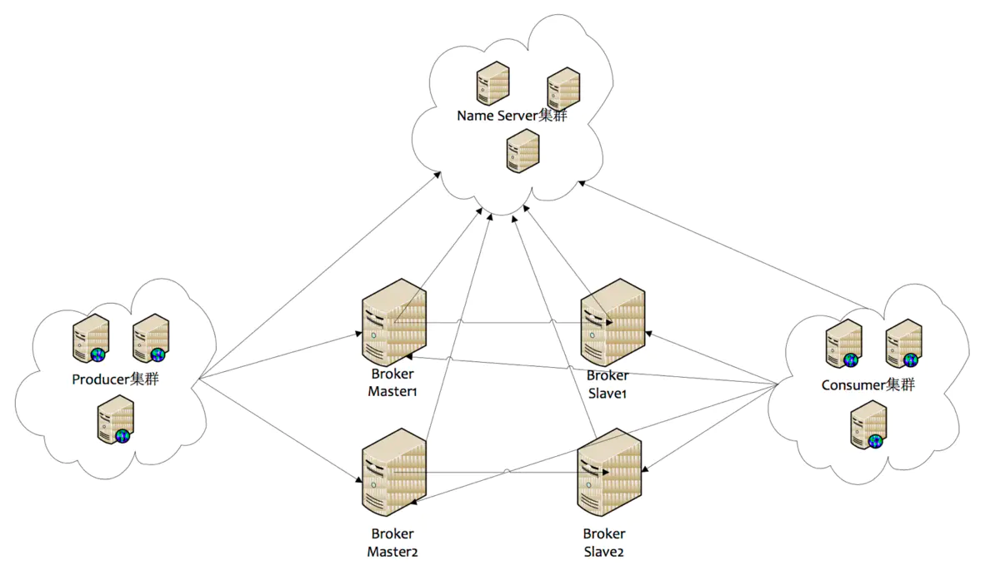

# RocketMQ 基础知识

## 角色
### Name Server
Name Server 是一个几乎无状态节点，可集群部署，节点之间无任何信息同步。

### Broker
Broker部署相对复杂，Broker分为Master与Slave(一对多关系)，他们之间存在着数据同步    
Master与Slave的对应关系通过指定相同的Broker Name，不同的Broker Id来定义，BrokerId为0表示Master，非0表示Slave。Master也可以部署多个。  
每个Broker与Name Server集群中的所有节点建立长连接，定时(每隔30s)注册Topic信息到所有Name Server。  
Name Server定时(每隔10s)扫描所有存活broker的连接，如果Name Server超过2分钟没有收到心跳，则Name Server断开与Broker的连接。

### Producer
Producer与Name Server集群中的其中一个节点(随机选择)建立长连接，定期从Name Server取Topic路由信息，并向提供Topic服务的Master建立长连接，且定时向Master发送心跳。Producer完全无状态，可集群部署。
Producer每隔30s（由ClientConfig的pollNameServerInterval）从Name server获取所有topic队列的最新情况，这意味着如果Broker不可用，Producer最多30s能够感知，在此期间内发往Broker的所有消息都会失败。
Producer每隔30s（由ClientConfig中heartbeatBrokerInterval决定）向所有关联的broker发送心跳，Broker每隔10s中扫描所有存活的连接，如果Broker在2分钟内没有收到心跳数据，则关闭与Producer的连接。

### Consumer
Consumer与Name Server集群中的其中一个节点(随机选择)建立长连接，定期从Name Server取Topic路由信息，并向提供Topic服务的Master、Slave建立长连接，且定时向Master、Slave发送心跳。Consumer既可以从Master订阅消息，也可以从Slave订阅消息，订阅规则由Broker配置决定。
Consumer每隔30s从Name server获取topic的最新队列情况，这意味着Broker不可用时，Consumer最多最需要30s才能感知。

# RocketMQ 数据存储
RocketMQ中的消息数据存储，采用了零拷贝技术（使用 mmap + write 方式），文件系统采用 Linux Ext4 文件系统进行存储。
## 消息数据的存储
在RocketMQ中，消息数据是保存在磁盘文件中，为了保证写入的性能，RocketMQ尽可能保证顺序写入，顺序写入的效率比随机写入的效率高很多。
RocketMQ消息的存储是由ConsumeQueue和CommitLog配合完成的， CommitLog是真正存储数据的文件，ConsumeQueue是索引文件，存储数据指向到物理文件的配置。

## Broker的主从同步
同步双写的本质，master 先写磁盘，然后等待 slave 同步消息成功
